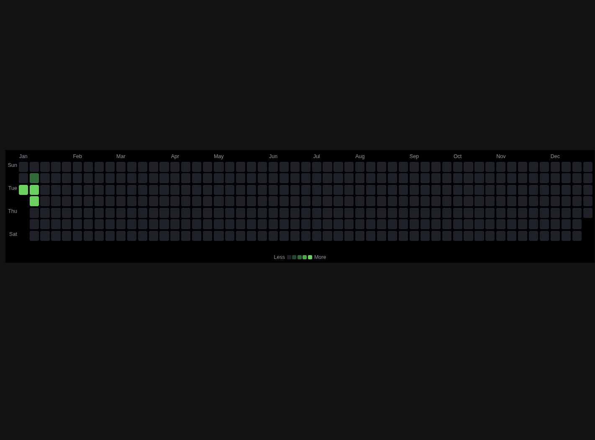

# GitHub Contributions Widget

A beautiful widget addon for [MyWallpaper](https://mywallpaper.online) that displays your GitHub contribution graph - the famous green squares showing your daily commits and activity throughout the year.



## Features

- **Real GitHub Data**: Fetches your actual contribution data via GitHub's GraphQL API
- **OAuth Integration**: Secure authentication through MyWallpaper's OAuth proxy (your tokens are never exposed)
- **Multiple Themes**: Choose from 6 built-in themes or create your own custom color scheme
- **Hot Reload**: Settings changes apply instantly without reloading
- **Data Caching**: Contributions are cached to reduce API calls
- **Responsive**: Automatically adapts to different widget sizes
- **Year Selection**: View contributions from current year or past years

## Settings

### Appearance
| Setting | Description | Default |
|---------|-------------|---------|
| Theme | Color scheme for the contribution squares | GitHub Green |
| Custom Color | Base color when using custom theme | #39d353 |
| Show Month Labels | Display month names above the graph | Yes |
| Show Day Labels | Display day names (Mon, Wed, Fri) | Yes |
| Show Tooltips | Show contribution count on hover | Yes |
| Show Stats | Display contribution statistics | Yes |

### Layout
| Setting | Description | Default |
|---------|-------------|---------|
| Cell Size | Size of each contribution square (px) | 12 |
| Cell Gap | Space between squares (px) | 3 |
| Border Radius | Roundness of squares (px) | 2 |

### Background
| Setting | Description | Default |
|---------|-------------|---------|
| Show Background | Enable background layer | Yes |
| Background Color | Color of the background | #0d1117 |
| Background Opacity | Transparency level (%) | 80 |
| Background Blur | Blur effect intensity (px) | 10 |

### Data
| Setting | Description | Default |
|---------|-------------|---------|
| Year | Which year to display | Current |
| Refresh Interval | How often to fetch new data (minutes) | 30 |

## Color Themes

- **GitHub Green** (Classic) - The original GitHub contribution colors
- **GitHub Dark** - Muted green tones for dark themes
- **Ocean Blue** - Cool blue gradient
- **Purple Rain** - Vibrant purple tones
- **Sunset Orange** - Warm orange colors
- **Pink Blossom** - Soft pink shades
- **Custom** - Choose your own base color

## SDK Features Used

This widget demonstrates the full capabilities of the MyWallpaper Addon SDK:

### OAuth Integration
```javascript
// Check if user is connected to GitHub
const isConnected = await api.oauth.isConnected('github');

// Request GitHub authentication
const result = await api.oauth.request('github');

// Check granted scopes
const scopes = await api.oauth.getScopes('github');

// Request additional scopes if needed
await api.oauth.requestScopes('github', ['read:user']);
```

### Network Proxy (Secure API Calls)
```javascript
// All requests go through the secure proxy
// Your OAuth tokens are NEVER exposed to the addon
const response = await api.network.fetch('https://api.github.com/user');
const user = await response.json();
```

### Storage API
```javascript
// Cache contribution data
await api.storage.set('contributionData', {
  user: userData,
  contributions: contributionData,
  timestamp: Date.now()
});

// Retrieve cached data
const cached = await api.storage.get('contributionData');
```

### System Events
```javascript
// React to theme changes
api.on('theme:change', () => {
  applyTheme(api.config);
});

// Pause/resume on visibility change
api.on('visibility:change', (data) => {
  if (data.hidden) {
    pauseRefresh();
  } else {
    resumeRefresh();
  }
});
```

### Hot Reload Settings
```javascript
// Listen for settings updates
window.addEventListener('message', (event) => {
  if (event.data?.type === 'SETTINGS_UPDATE') {
    // Apply new settings without full reload
    applyTheme(api.config);
  }
});
```

## Required Permissions

This widget requires the following permissions declared in `manifest.json`:

```json
{
  "permissions": {
    "storage": { "quota": 524288 },
    "network": { "domains": ["api.github.com"] }
  },
  "oauth": {
    "github": {
      "required": true,
      "scopes": ["read:user"]
    }
  }
}
```

## Installation

### From MyWallpaper Store
1. Open MyWallpaper app
2. Go to the Addon Store
3. Search for "GitHub Contributions"
4. Click Install
5. Add the widget to your desktop

### Manual Installation (Development)
1. Clone this repository
2. Open MyWallpaper Settings > Developer
3. Enable Developer Mode
4. Enter the path to your local addon folder
5. The widget will appear in your addons list

## Development

```bash
# Clone the repository
git clone https://github.com/rayandu924/github-contributions-widget.git

# Navigate to the project
cd github-contributions-widget

# Open in your editor
code .
```

### Project Structure

```
github-contributions-widget/
├── manifest.json    # Addon metadata and settings schema
├── index.html       # Main HTML structure
├── widget.js        # JavaScript logic (SDK integration)
├── icon.png         # Widget icon (128x128)
├── preview.png      # Preview image for store
└── README.md        # This file
```

## Security Notes

1. **OAuth Tokens**: Your GitHub OAuth token is never exposed to this widget. All API calls go through MyWallpaper's secure proxy.

2. **Sandboxed Execution**: This widget runs in an isolated iframe with strict Content Security Policy (CSP).

3. **Safe DOM Methods**: Uses `createElement` and `textContent` instead of `innerHTML` to prevent XSS vulnerabilities.

4. **Network Restrictions**: Can only make requests to whitelisted domains (`api.github.com`).

## License

MIT License - See [LICENSE](LICENSE) for details.

## Author

Created by [rayandu924](https://github.com/rayandu924) for [MyWallpaper](https://mywallpaper.online)

---

**Note**: This widget requires a GitHub account and MyWallpaper app to function.
